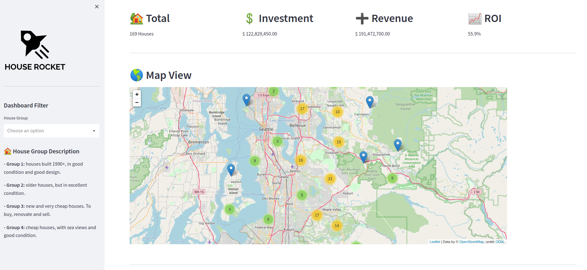

# House Rocket Data Analysis

### Identification of real estate opportunities for purchase and resale

## 1. Abstract

This **Data Analysis Project** presents the House Rocket, a fictitious company (inspired by the challenge published on this [kaggle](https://www.kaggle.com/datasets/shivachandel/kc-house-data)), which operates in the real estate industry and uses technology to simplify the purchase and sale of properties.

For the next round of investments, the company's CEO has a budget of 100 million dollars to invest in a portfolio of 21,613 properties, located in Seattle, and needs to define how this investment will be allocated and what the expected return will be.

The solution built to present the investment allocation suggestions was developed from the information obtained from the Exploratory Data Analysis and organized in this [dashboard](https://house-rocket-vitorhmf.herokuapp.com/) made with Streamlit and put into production on Heroku Cloud.

*Example: dashboard map view.*

The full dashboard can be accessed through this [link](https://house-rocket-vitorhmf.herokuapp.com/).

**Keywords:** Python, Pandas, Numpym, Seaborn, Folium, Streamlit, Heroku Cloud.

## 2. Business Understanding

### 2.1. Context

A new round of investments will be carried out by House Rocket and the company's CEO has a budget of 100 million dollars to invest in a portfolio of 21,613 properties, located in Seattle. Now he needs to define two points:

* 1. What properties should House Rocket buy?
* 2. Once the house is purchased, when is the best time to sell it and at what price?

To help the CEO to take a data-driven decision, a detailed data analysis of the portfolio of properties available for purchase was performed.Initially the dataset had the following features:

| Feature                | Definition                                                                                               |
|------------------------|----------------------------------------------------------------------------------------------------------|
| id                     | Unique ID for each home                                                                                  |
| date                   | Date of the home sale                                                                                    |
| price                  | Price of each home                                                                                       |
| bedrooms               | Number of bedrooms                                                                                       |
| bathrooms              | Number of bathrooms, where .5 accounts for a room with a toilet but no shower                            |
| sqft_living            | Square footage of the apartment interior living space                                                    |
| sqft_lot               | Square footage of the land space                                                                         |
| floors                 | Number of floors                                                                                         |
| waterfront             | A dummy variable for whether the apartment was overlooking the waterfront or not                         |
| view                   | An index from 0 to 4 of how good the view of the property was                                            |
| condition              | An index from 1 to 5 on the condition of the apartment                                                   |
| grade                  | An index from 1 to 13, where 1-3 falls short of building construction and design, 7 has an average level of construction and design, and 11-13 have a high-quality level of construction and design. |
| sqft_above             | The square footage of the interior housing space that is above ground level                              |
| sqft_basement          | The square footage of the interior housing space that is below ground level                              |
| yr_built               | The year the house was initially built                                                                   |
| yr_renovated           | The year of the house’s last renovation                                                                  |
| zipcode                | What zipcode area the house is in                                                                        |
| lat                    | Lattitude                                                                                                |
| long                   | Longitude                                                                                                |
| sqft_living15          | The square footage of interior housing living space for the nearest 15 neighbors                         |
| sqft_lot15             | The square footage of the land lots of the nearest 15 neighbors                                          |

*Source:* [Kaggle](https://www.kaggle.com/datasets/astronautelvis/kc-house-data)

### 2.2. Business assumption: 

* Houses without bathrooms and with a value above 4 million were not considered;
* The seasons of the year were defined as follows:
    - Winter: December, January and February;
    - Spring: March, April and May;
    - Summer: June, July, August;
    - Autumn: September, October and November

## 3. Data Understanding

### 3.1. Data Wrangling

To build an overview of the data, the following steps were performed:

* Check NA: the dataset did not have any missing values;
* Change date types from object to datetime;
* Change the floor's number from float64 to int64;

### 3.2 Data Descriptive

A quick descriptive analysis of numerical and categorical variables was performed to generate a preview of the data.

**Numerical Attributes:**

**Categorical Attributes:**

### 3.3. Feature Engineering

### 3.4. Data Filtering

### 3.5. Exploratory Data Analysis

## 4. Evaluation

## 5. Deployment

## 6. Conclusion

### 6.1. Business Results

### 6.2. Next Steps

## 7. References

* [Comunidade DS](https://www.comunidadedatascience.com/)
* [Kaggle](https://www.kaggle.com/datasets/shivachandel/kc-house-data)

<!--
Para construir a solução desejada, foi realizada a análise exploratória dos dados do portfólio de imóveis e foram selecionadas 811 casas como sugestão de compra. Essa seleção foi feita escolhendo os imóveis que estavam pelo menos 30% abaixo da média de preço da região e que estavam classificados com um ótimo estado de conservação (notas 4 e 5 em uma escala de 1 a 5).

Com relação a estratégia comercial, foi analisado o período do ano em que cada região apresentava maior média de preços, definindo assim quando é melhor revender cada imóvel. E a precificação foi estipulada buscando um ROI de 40% do investimento realizado.

## Apresentação da Solução:

Para apresentar as respostas das questões de negócio, foi desenvolvido um dashboard contendo:
  - Visão Geral do Portfólio: nessa etapa é apresentado o dataset original e feita uma analise estatística descritiva dos dados.
  - Análise do Investimento: a análise do investimento foi feita apresentando uma descrição do ROI, dos imóveis selecionados e a visualização no mapa.
  - Hipóteses de Negócio: análises complementares dos dados, validando hipóteses que possam gerar ações e auxiliar no direcionamento da tomada de decisão da empresa.

Link da solução: https://house-rocket-vitorhmf.herokuapp.com/
-->
